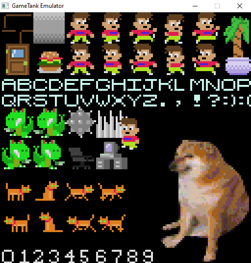
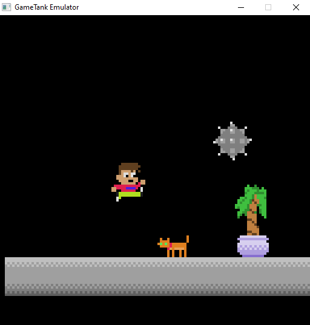

# GameTank Emulator

An emulator project for the GameTank 8-bit game console, to speed cross-development of software for the real system.

Powered by gianlucag's 6502 emulator library. (Forked to add some WDC 65C02 opcodes)

Currently I've only been testing and building this on Windows 10, but might eventually set up build scripts for Linux/OSX??

|  |  |
|-----------------|--------------------|

## How to use:
The emulator is meant to test the same ROM files that I'd normally flash to an EEPROM cartridge. You can start the emulator with a ROM file
either from the command line eg. `./GameTankEmulator.exe conway.gtr` or by dragging the ROM to the executable in Windows Explorer.

ROM files can be produced using the [VASM assembler](http://sun.hasenbraten.de/vasm/) for WDC65C02 code, and should be output as headerless binaries. Currently the ROM files are assumed to be 8192 bytes in length, and are mapped to the memory range from 0xE000 through 0xFFFF.

Gamepad input is emulated (only on port A right now) with the arrow keys, Z, X, C, and Enter.

Other utility keys are:

* Hold F to go Fast (skip SDL_Delay between batches of emulated instructions)

* Press R for soft Reset (set registers to zero, jump execution to the RESET vector, but otherwise memory is left intact)

* Press Esc to exit the program

_For now I'm listing the differences between the emulator and the real hardware; stopping short of writing a programming manual for the GameTank which will be a separate wiki-like document to come later_

## Emulated Capabilities:

### Video:

The graphics board of the GameTank has all its features emulated in a _mostly accurate_ fashion. The emulated graphics can do anything you probably intended to do on the real thing, minus the composite video artifacts. Also absent is at least one known bug in the hardware that I hope to fix later.

On the graphics board is 32K of framebuffer memory, 32K of "asset" or "sprite" memory, and a handful of control registers for a blitting engine. The rendered image is 128x128 pixels, though a TV cuts off the first and last few rows for an effective resolution of 128x100. Also the column 0 color is used for the border on each row, stretching between the image area and the true edges of the screen.

The DMA controller can be configured for direct CPU access to either page of the framebuffer, either page of the asset memory, or access to the blitting registers. Blitting operations consist of setting the width, height, X and Y within the asset memory, X and Y within the framebuffer for a rectangular area. The blitter will begin copying when its trigger register is written to.

The blitter can also be used to draw rectangles of solid color, or to skip copying pixels with value 0x00 to treat them as transparent.

**Note:** The emulated blitting engine copies sprites relatively instantly, but the actual hardware copies at a rate closer to 4 pixels per CPU clock cycle.

### Audio:

The soundcard, whimsically named "DynaWave", generates mono audio from a mix of four channels:

* Square Wave 1

* Square Wave 2

* LFSR Noise

* Wavetable playback (4096 bytes, 8-bit unsigned audio, variable sample rate)

The two square waves have 8-bit pitch, 3-bit octave select, and 3-bit volume control. The LFSR and Wavetable lack the 8-bit pitch, but have the same octave select and volume control. Additionally the Wavetable has a register pointing to the start of sample data, which it returns to whenever it hits a 0xFF sample.

Currently the timing of the audio playback is not synchronous with the cycle count on the CPU. It just kind of generates more audio from whatever the registers are set to, whenever the SDL audio callback feels like it.

### Input:

As mentioned above, a gamepad is emulated with the keyboard keys. (I figured it'd be more convenient to list the key bindings at the top.)

The emulated gamepad is updated during VSync, whereas the real system latches the values from the controller as the register is read.

You can think of the Z, X, C, and Enter as A, B, C, Start on a Sega Genesis controller; which is what I'm testing the physical system with. Eventually I plan to design a custom controller compatible with the same interface.
### Versatile Interface Adapter (VIA):

In the real system, this is mostly used for setting up IRQ timer interrupts. But it also is wired to a header for a sort of parallel port, as well as another header that could maybe be used for I2C interface to special cartridges.

In the emulated system... yeah none of this is implemented quite yet. The timers will come soon, and maybe the parallel port and I2C stuff if I don't decide to axe those features in the hardware.
