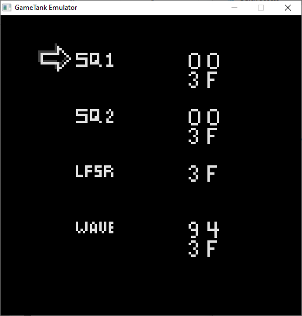

# GameTank Sound Test Utility

Here is the source to $repo/roms/soundtest.gtr

This application lets you directly control the registers of the DynaWave soundcard.

## Controls:

* Up/down - Select a register

* Left/right - Adjust the selected parameter

* A button - Hold to adjust parameters faster

* Start - Press to reset all registers

## Registers:

* Square1, Square 2 - First byte controls pitch, second byte is a combined volume and octave control

* LFSR - Combined volume and octave control

* Wave - First byte is the start pointer for the looping sample, divided by 16. Second byte is combined volume and octave control.

## Files:

* soundtest.asm - The main source for the test app

* inflate_e000.obx - Preassembled [zlib6502](https://github.com/pfusik/zlib6502) binary, library written by Piotr Fusik

* samples3.raw.deflate - Compressed wavetable data

* mainscreen.bmp - Sprite sheet for UI

* mainscreen.gtg - mainscreen.bmp with the header removed

* mainscreen.gtg.deflate - Compressed mainscreen.gtg, included in soundtest.gtr when assembled